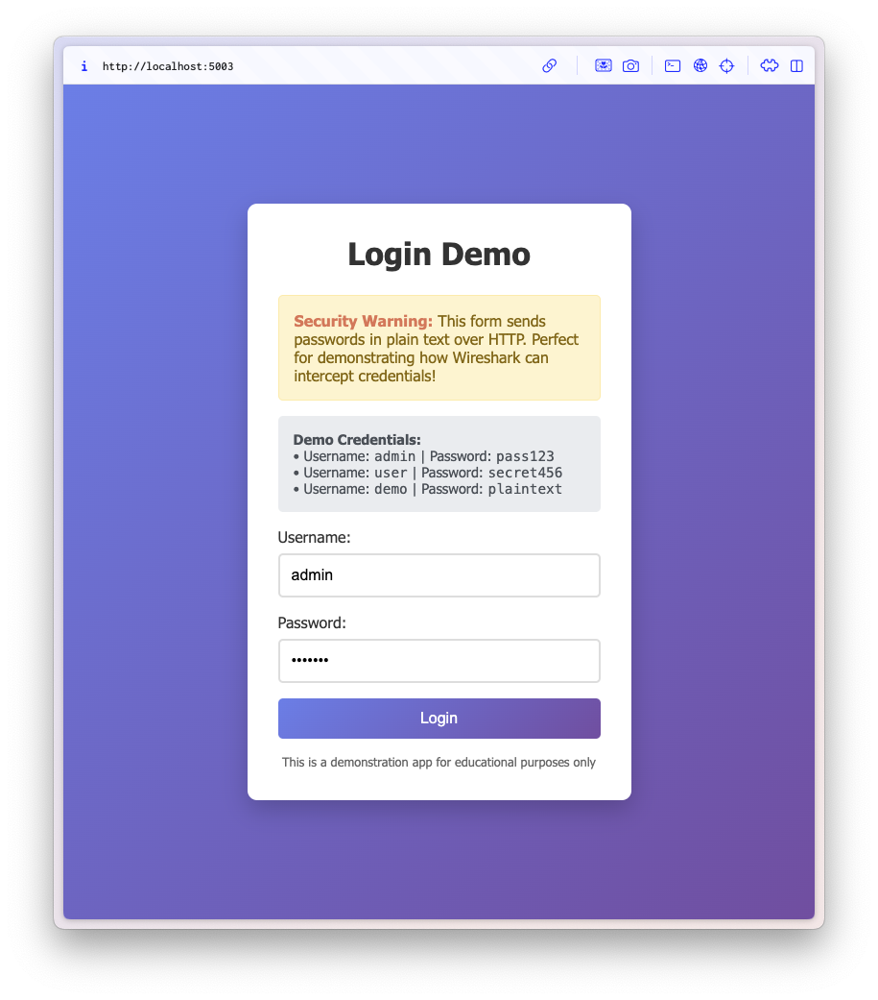
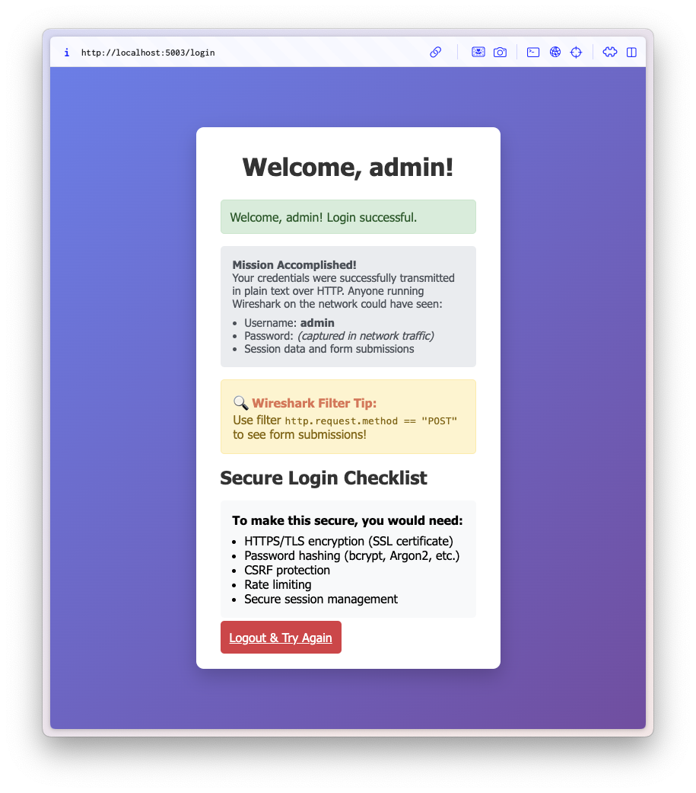
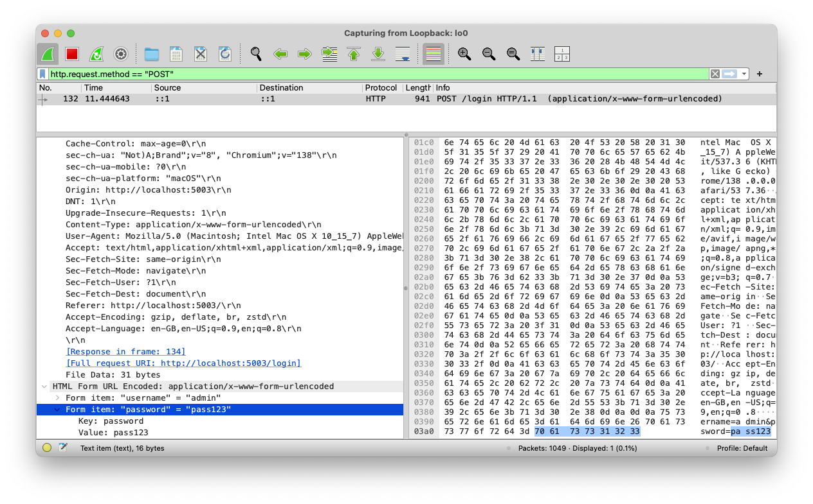

[](https://github.com/mavi0/flask-password-demo/actions/workflows/ci.yml)

# Flask Password Security Demo

A deliberately insecure Flask login application designed to demonstrate how **Wireshark** can be used to intercept plain text passwords over HTTP connections.


## Quick Start - Using Docker

```bash

docker run --rm -p 5000:5000 ghcr.io/mavi0/flask-password-demo:latest
```

Visit `http://localhost:5000` in your browser.

### Demo Credentials
- **Username:** `admin` | **Password:** `pass123`
- **Username:** `user` | **Password:** `secret456`  
- **Username:** `demo` | **Password:** `plaintext`


## Screenshots

### Login Page


### Dashboard (After Login)


### Wireshark Packet Capture


## And finally: A quick howto for capturing credentials with Wireshark

1. Ensure **Wireshark** is installed on your system
2. **Start the application** using Docker using the `docker run` command above
3. **Open Wireshark** and start capturing on the relevant network interface  - up to you to figure out which one (usually `lo0` for localhost traffic as in the screenshot)
4. **Filter traffic** by typing `http.request.method == "POST"` in the filter bar
5. **Login to the application** using any of the demo credentials
6. **Stop capture** and look for POST requests to `/login`
7. Click on **HTTP Form URL** field to expand the section 
8. **View the credentials** in plain text within the form data

<p align="center"><i><sub>Remember: Always use HTTPS in production!</sub></i></p>